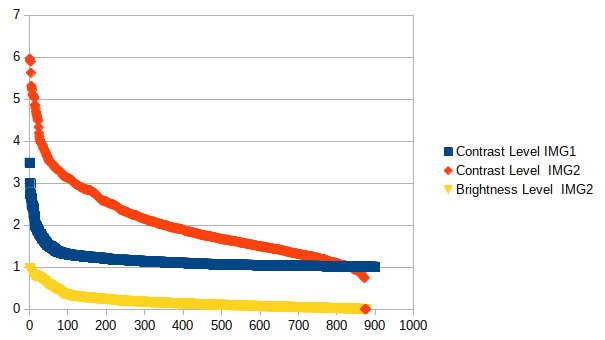

# Dirt removal with Dirt Mask

## Installation
### gimpfu
### smallestenclosingcircle

## Usage
### Parameters

## Analysis
### Parameter picking
The parameters for contrast were taken out of two images: a person in front of water(1) and a waterfall in the forest(2):

### Problems:
pool.map seems to have problems calculating pool.map(lambda x:f(x,a,b,c),list) for fixed a,b,c.
The following Error occurs:
cPickle.PicklingError: Can't pickle <type 'function'>: attribute lookup __builtin__.function failed
In this case the function partial should be used [1]

Also working with a Queue an Processes got stuck sometimes (larger images)

### Computing tinmes
Times for Calculating in parallel or not (as comments in code):

parallel single
load time:  0.0821390151978
find heal time:  5.16196799278
heal time:  4.91810297966

single
load time:  0.167742013931
find heal time:  1.17766499519
heal time:  5.1039288044

parallel batch
load time:  0.0962250232697
find heal time:  1.56606888771
heal time:  5.10925316811

batch
load time:  0.0910410881042
find heal time:  1.09560799599
heal time:  5.1529481411
total 877 circles

[1] https://stackoverflow.com/questions/5442910/python-multiprocessing-pool-map-for-multiple-arguments
